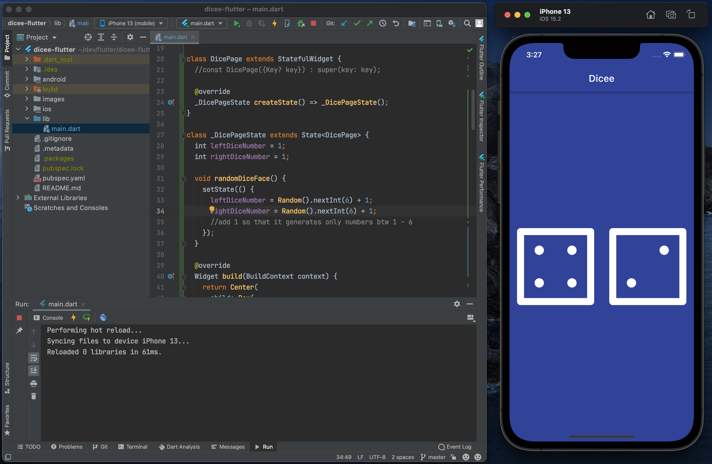

# Dicee 🎲
A simple Las Vegas dice app. You can make the die roll at the press of some buttons. Simply click on any of the dice on the UI to change/roll the dice.

## Dicee app screenshot

## Lessons learnt
App built from Complete Flutter Development Bootcamp. Learnt the following by building dicee app:
- How to use Flutter stateless widgets to design the user interface.
- How to use Flutter stateful widgets to update the user interface.
- How to change the properties of various widgets.
- How to use onPressed listeners to detect when buttons are pressed.
- How to use setState to mark the widget tree as dirty and requiring update on the next render.
- How to use Expanded to make widgets adapt to screen dimensions.
- Understand and use string interpolation.
- Learn about basic dart programming concepts such as data types and functions.
- Code and use gesture controls.